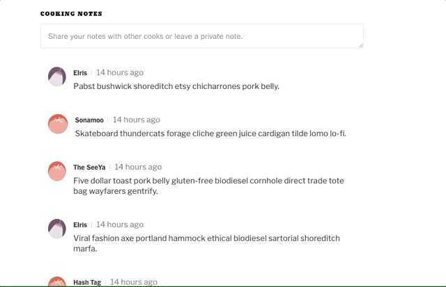
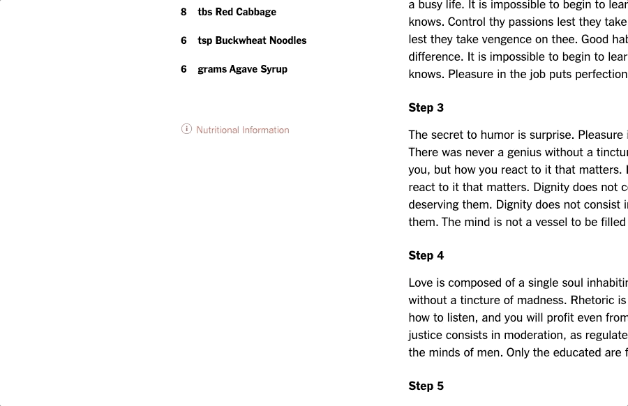

## Hancooking

[HanCooking](http://hancooking.herokuapp.com/#/) is a clone of [New York Times Cooking](https://cooking.nytimes.com/) focusing on modern and classic Korean cuisine. Users can discover recipes, rate them, comment on them, and save them to a Recipe Box for easy reference in the future.

![home]: (img/homepage.png "HanCooking")

### Technologies used
* Front-end:
  * React
  * Redux
  * Edamam Nutritional Analysis API
* Back-end
  * Ruby on Rails
  * PostgreSQL
* Cloud:
  * AWS S3
  * Heroku

### Features
* Recipes - beautiful recipe pages with ability to rate, add notes, and view nutritional information
  

* Recipe Box - save recipes to your Recipe Box for easy future access
  

* Search - search for recipes by title or description
  

* Rating - see the commmunity's average rating and provide your rating on a scale to 1-5
  

* Notes - view recipe notes left by others and leave your own
  

* Nutritional information - powered by the Edamam API, view the nutritional contents of a recipe
  

### Future features
* Grocery list - add ingredients to a shopping list
* Mark as Cooked - indicate which recipes you've already cooked
