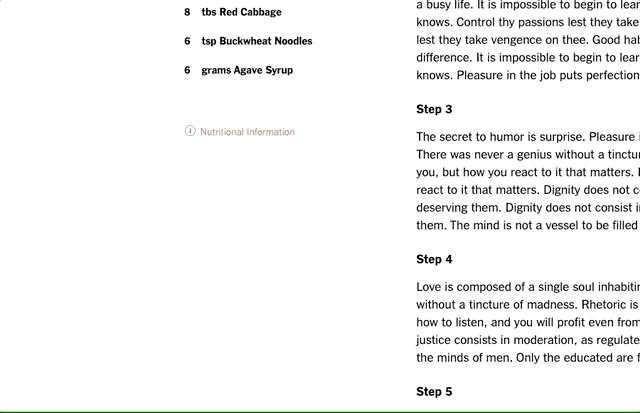

# Hancooking

[HanCooking](http://hancooking.herokuapp.com/#/) is inspired by [New York Times Cooking](https://cooking.nytimes.com/) and focuses on modern and classic Korean cuisine. Users can discover recipes, rate them, comment on them, and save them to a Recipe Box for easy reference in the future.


## Technologies used
* Front-end:
  * React
  * Redux
  * Edamam Nutritional Analysis API
* Back-end
  * Ruby on Rails
  * PostgreSQL
* Cloud:
  * AWS S3
  * Heroku

## Features
* #### Recipes - beautiful recipe pages with ability to rate, add notes, and view nutritional information
  

* #### Recipe Box - save recipes to your Recipe Box for easy future access
  

* #### Search - search for recipes by title or description
  

* #### Rating - see the commmunity's average rating and provide your rating on a scale to 1-5
  

* #### Notes - view recipe notes left by others and leave your own
  

* #### Nutritional information - powered by the Edamam API, view the nutritional contents of a recipe
  

### Future features
* Grocery list - add ingredients to a shopping list
* Mark as Cooked - indicate which recipes you've already cooked
* Local Korean market finder

### Code Snippets

#### Star Ratings
To implement star ratings, the `useState` React Hook to manage local state for
detecting if the user is hovering over the rating component, which star they're
hovering over, and which text should be displayed based on the star hover

```javascript
import React, { useState } from 'react';

export const Rating = (props) => {
    let {
        recipe,
        ratings,
        currentUser,
        match,
        updateRating,
        createRating
    } = props;
    
    const [ratingHover, setRatingHover ] = useState(false);
    const [starHover, setStarHover ] = useState(recipe ? recipe.avgRating : 0);
    const [ratingText, setRatingText ] = useState("Rate Recipe");

    const handleRatingSubmit = val => {

        if (currentUser.ratedRecipeIds.includes(parseInt(match.params.recipeId))) { 
          updateRating({
            recipe_id: recipe.id,
            star_rating: val
          })
        } else {
          createRating({
            recipe_id: recipe.id,
            star_rating: val
          })
        }
    };
    
    const handleStarHover = val => {
        setStarHover(val);
    
        switch (val) {
            case 1:
                setRatingText("Not Worth It")
                break;
            case 2:
                setRatingText("Fine")
                break;
            case 3:
                setRatingText("Good")
                break;
            case 4:
                setRatingText("Really Good")
                break;
            case 5:
                setRatingText("Delicious")
                break;
            default:
                null
        };
    };

    const hoverStarRating = () => {
        let hoverStarRating = [];

        for(let i = 1; i <= 5; i++) {
            hoverStarRating.push(
            = i
                ? window.starYellowURL
                : window.starEmptyURL}
                onMouseOver={()=>handleStarHover(i)}
                onClick={()=>handleRatingSubmit(i)}
            />)
        }
        
        return hoverStarRating.map(star => star);
    };

    const currentStarRating = () => {
        let starRating = [];

        if (recipe) {
            if (ratings[0]
                && currentUser.ratedRecipeIds
                    .includes(parseInt(match.params.recipeId))
            ) {

                const currentUserRatings = 
                    ratings.filter(rating => rating.userId === currentUser.id);

                const currentUserRating =
                    currentUserRatings.length > 0 && currentUserRatings[0]
                    ? currentUserRatings[0].starRating
                    : null;

                for(let i = 1; i <= 5; i++) {
                    starRating.push(
                    = i
                        ? window.starYellowURL
                        : window.starEmptyURL }
                    />);
                };
            } else {
                for(let i = 1; i <= 5; i++) {
                    starRating.push(
                        = i
                            ? window.starRedURL
                            : window.starEmptyURL }
                        />
                    );
                };
            }
        }
        
        return starRating.map(star => star);
    };
    
    return (
        <div className="recipe-metadata-container">
            <div className={ratingHover ?
                "rating-tooltip-open"
                : "rating-tooltip-closed"}
                onMouseLeave={()=>setRatingHover(false)}
            >
                <span className = "rating-text">{ratingText}</span>
                <div className = "recipe-rating-avg-stars">
                { hoverStarRating() }
                </div>
            </div>
          <div className="rating-total">{recipe.numRatings} ratings</div>
          <div className="star-rating"
            onMouseEnter={() => setRatingHover(true)}
          >
            <div className = "recipe-rating-avg-stars">
                { currentStarRating() }
            </div>
          </div>
        </div>
    )
};
```